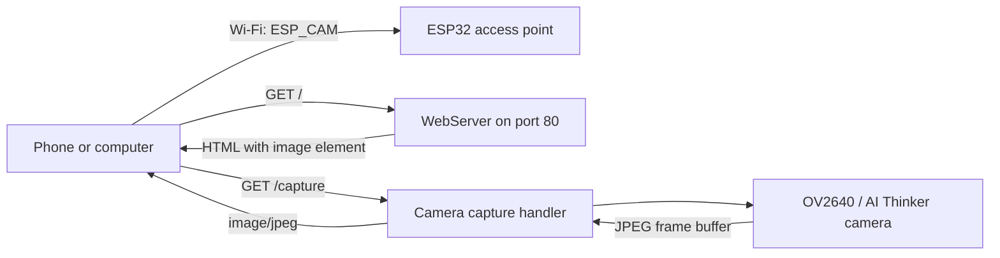

# ESP32-CAM Wi-Fi Snapshot Server


A compact ESP32-CAM firmware that creates its own Wi-Fi access point and serves JPEG snapshots from an AI Thinker camera module. No router or internet connection is required: connect directly to the board, open its local web page, and request the latest image.

## Features

- Creates a standalone Wi-Fi access point named `ESP_CAM`.
- Starts an HTTP server on port 80.
- Serves a minimal viewer page at `/`.
- Captures and returns a fresh JPEG image at `/capture`.
- Uses VGA frames, two frame buffers, and latest-frame capture when PSRAM is available.
- Falls back to QVGA, one frame buffer, and DRAM when PSRAM is unavailable.
- Prints startup state, access-point address, and camera errors to the serial monitor.
- Uses PlatformIO for repeatable builds and uploads.

## How it works



The root page contains an `` element pointing to `/capture`. This displays one snapshot when the page loads; the current firmware does not provide an MJPEG stream or automatic refresh.

## Hardware

- AI Thinker ESP32-CAM module
- OV2640 camera, normally bundled with the board
- USB-to-serial adapter capable of supplying stable power
- Jumper wires
- A 5 V supply suitable for the ESP32-CAM's current demand

### Camera pin map

The pin assignments in `src/main.cpp` match the AI Thinker ESP32-CAM layout.

| Signal | GPIO | Signal | GPIO |
| --- | ---: | --- | ---: |
| PWDN | 32 | XCLK | 0 |
| SIOD | 26 | SIOC | 27 |
| Y2 | 5 | Y3 | 18 |
| Y4 | 19 | Y5 | 21 |
| Y6 | 36 | Y7 | 39 |
| Y8 | 34 | Y9 | 35 |
| VSYNC | 25 | HREF | 23 |
| PCLK | 22 | RESET | Not connected (`-1`) |

## Build and upload

### Prerequisites

- Visual Studio Code with the PlatformIO extension, or PlatformIO Core
- A USB-to-serial adapter
- A data-capable USB cable

### PlatformIO Core

1. Clone the repository:

   ```bash
   git clone https://github.com/BBBsouheil/esp32-cam-project.git
   cd esp32-cam-project
   ```

2. Build the firmware:

   ```bash
   pio run
   ```

3. Connect the programmer. For the common AI Thinker flashing procedure, connect the adapter's TX to U0R, RX to U0T, share ground, power the board from 5 V, and hold GPIO0 low during reset/upload. Verify the voltage and wiring for your exact adapter and board revision.

4. Upload:

   ```bash
   pio run --target upload
   ```

5. Release GPIO0 from ground, reset the board, and open the serial monitor:

   ```bash
   pio device monitor
   ```

The monitor is configured for 115200 baud. If PlatformIO cannot select the correct serial device, add `upload_port` and `monitor_port` to `platformio.ini` or pass them on the command line.

## Use

1. Power or reset the board in normal boot mode.
2. Wait for `WiFi AP pret` and the access-point IP address in the serial monitor.
3. Connect a phone or computer to:

   | Setting | Default |
   | --- | --- |
   | SSID | `ESP_CAM` |
   | Password | `12345678` |

4. Open the IP address printed by the board. With the default ESP32 soft-AP configuration this is normally `http://192.168.4.1/`.
5. Open `/capture` directly to retrieve a JPEG, or reload the root page to request a new image.

> [!WARNING]
> The SSID and password are hard-coded demonstration values. Change them in `src/main.cpp` before using the project outside a controlled lab environment.

## Camera configuration

| Condition | Resolution | JPEG quality | Buffers | Memory | Capture mode |
| --- | --- | ---: | ---: | --- | --- |
| PSRAM detected | VGA (640 × 480) | 10 | 2 | PSRAM | Latest frame |
| No PSRAM | QVGA (320 × 240) | 12 | 1 | DRAM | When empty |

In the ESP32 camera driver, a lower JPEG quality number requests higher image quality and generally produces a larger payload.

## HTTP endpoints

| Method | Path | Response |
| --- | --- | --- |
| `GET` | `/` | Minimal HTML page containing the camera image. |
| `GET` | `/capture` | Newly captured JPEG with `Content-Type: image/jpeg`. |

If the camera cannot provide a frame, `/capture` returns HTTP 500 with `Camera error`.

## Repository structure

```text
esp32-cam-project/
├── src/
│   └── main.cpp          Camera, Wi-Fi, and HTTP server logic
├── include/              PlatformIO include placeholder
├── lib/                  PlatformIO local-library placeholder
├── test/                 PlatformIO test placeholder
├── platformio.ini        ESP32-CAM build and monitor configuration
└── .gitignore
```

## Known limitations

- The root page displays a snapshot, not a live video stream.
- Wi-Fi credentials are compiled into the firmware.
- The HTTP service has no application-level authentication or TLS; any client connected to the access point can request images.
- The access-point name, password, camera pins, frame settings, and routes are not configurable at runtime.
- Camera initialisation failure is logged, but the HTTP server still starts and later capture requests fail.
- Requests are handled synchronously by Arduino's `WebServer`; the firmware is intended for lightweight single-client use.
- There is no image persistence, SD-card support, remote upload, OTA update, or automated test suite.
- No project license is currently included in the repository.

## Possible improvements

- Add automatic snapshot refresh or an MJPEG streaming endpoint.
- Move credentials and camera settings to a local configuration file excluded from Git.
- Add a setup portal for changing the access-point settings.
- Protect image access with authentication and use an appropriate secure network architecture.
- Add camera controls for frame size, quality, brightness, and orientation.
- Stop or restart cleanly when camera initialisation fails.
- Add SD-card capture, timestamps, motion triggering, or upload to another service.
- Add health/status endpoints and PlatformIO tests for non-hardware logic.

## License

No license file is currently included. All rights remain with the copyright holders unless a license is added.
